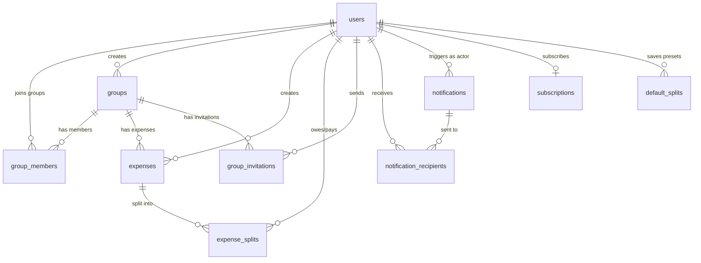

# Splitwise Clone — Database Schema & Architecture Plan (v2)

> [!IMPORTANT]
> **This is the FINAL schema document.** All your lead's tech requirements and your answers are incorporated. Review carefully, then we start building together.

---

## Project Tech Stack (Final)

| Layer | Technology | Notes |
|---|---|---|
| **Language** | Ruby 3.4.9 | |
| **Framework** | Rails 8.1.3 | API + Views (Hotwire/Turbo) |
| **Database** | **PostgreSQL** | Industry standard, supports concurrency, JSON, full-text, proper enums. **We'll switch from SQLite3.** |
| **Auth** | **Devise** | Login, signup, password reset, remember me |
| **Authorization** | **CanCanCan** | Role-based access (admin/premium/simple), feature gates |
| **Search (Full)** | **Elasticsearch** | Activity search, full-text search across expenses |
| **Search (Simple)** | **Ransack** | Filtering by category, date, status — simple scoped queries |
| **Cache/Queue Backend** | **Redis** | Session store, cache, Sidekiq job queue backend |
| **Background Jobs** | **Sidekiq** | Replaces Solid Queue — email sending, notifications, ES indexing |
| **Email Service** | **AWS SES** | Transactional emails (invitations, reminders, notifications) |
| **File Uploads** | **Active Storage** | Avatars, expense proofs, settlement proofs (S3 in production) |
| **Containerization** | **Docker** | Already configured in project |
| **Deployment** | **AWS** (ECS/EC2) | Production hosting on Amazon AWS |
| **Currency** | **Multi-currency** | Each expense stores its own currency code (ISO 4217) |

---

---

## Premium vs Simple User — Feature Gates

Your lead wants clear restrictions for simple (free) users. Here's the complete breakdown:

| Feature | Simple User (Free) | Premium User | Admin |
|---|---|---|---|
| **Add expenses** | ✅ Daily limit (default: 5/day) | ✅ Unlimited | ✅ Unlimited |
| **Settle up** | ✅ Daily limit (default: 3/day) | ✅ Unlimited | ✅ Unlimited |
| **Create groups** | ❌ Cannot create | ✅ Unlimited | ✅ Unlimited |
| **Join groups** | ✅ Can join if invited | ✅ Can join if invited | ✅ Can join if invited |
| **View charts** | ❌ No access | ✅ Full access | ✅ Full access |
| **Send reminders** | ❌ Cannot send | ✅ Can send | ✅ Can send |
| **Save default splits** | ❌ No access | ✅ Can save | ✅ Can save |
| **Search expenses** | ❌ No search (Elasticsearch) | ✅ Full search | ✅ Full search |
| **Filter by category** | ✅ Basic Ransack filter | ✅ Full Ransack filter | ✅ Full filter |
| **Export CSV/Excel** | ❌ No access | ✅ Full export | ✅ Full export |
| **Whiteboard** | ❌ No access | ✅ Full access | ✅ Full access |
| **Manage users** | ❌ No access | ❌ No access | ✅ Full CRUD |

> [!TIP]
> These feature gates are enforced by **CanCanCan** in the `Ability` class — not by database columns. The user's `role` enum (`simple`, `premium`, `admin`) drives all permissions. The daily limits (`daily_expense_limit`, `daily_settlement_limit`) are stored on the `users` table so admins can customize per user.

---

## Entity Relationship Diagram



---

## Table Schemas

---

### 1. `users`

The core user table. Stores auth, profile, role, limits, and balance.

| Column | Type | Constraints | Description |
|---|---|---|---|
| `id` | `bigint` | **PK**, auto-increment | Primary key |
| `email` | `string` | **NOT NULL**, unique, indexed | Login email |
| `encrypted_password` | `string` | **NOT NULL** | Devise-managed bcrypt hash |
| `username` | `string` | **NOT NULL**, unique, indexed | Display name |
| `phone_number` | `string` | nullable, indexed | Optional phone |
| `role` | `integer` | **NOT NULL**, default: `0` | Enum → `0: simple`, `1: premium`, `2: admin` |
| `daily_expense_limit` | `integer` | **NOT NULL**, default: `5` | Max expenses per day (0 = unlimited for premium/admin) |
| `daily_settlement_limit` | `integer` | **NOT NULL**, default: `3` | Max settlements per day (0 = unlimited for premium/admin) |
| `balance_cents` | `integer` | **NOT NULL**, default: `0` | Net balance in cents. **+** = others owe you. **−** = you owe others. |
| `default_currency` | `string` | **NOT NULL**, default: `"PKR"` | User's preferred currency (ISO 4217) |
| `last_login_at` | `datetime` | nullable | Tracked by Devise |
| `reset_password_token` | `string` | nullable, unique | Devise password reset |
| `reset_password_sent_at` | `datetime` | nullable | Devise password reset |
| `remember_created_at` | `datetime` | nullable | Devise "remember me" |
| `created_at` | `datetime` | **NOT NULL** | Rails timestamp |
| `updated_at` | `datetime` | **NOT NULL** | Rails timestamp |

**Active Storage Attachments:**
- `avatar` → `has_one_attached :avatar` (profile picture, stored on S3 in production)

**Indexes:**
- `index_users_on_email` (unique)
- `index_users_on_username` (unique)
- `index_users_on_phone_number`
- `index_users_on_role`

> [!TIP]
> When a user upgrades to premium, we set `role: :premium`, `daily_expense_limit: 0`, `daily_settlement_limit: 0`. The `0` means unlimited — checked by CanCanCan in the `Ability` class.

---

### 2. `groups`

Represents a shared expense group (Home, Trip, Couple, etc.). Only premium/admin users can create groups.

| Column | Type | Constraints | Description |
|---|---|---|---|
| `id` | `bigint` | **PK**, auto-increment | Primary key |
| `creator_id` | `bigint` | **NOT NULL**, FK → `users.id`, indexed | Who created the group |
| `name` | `string` | **NOT NULL** | Group name |
| `group_type` | `integer` | **NOT NULL**, default: `0` | Enum → `0: home`, `1: trip`, `2: couple`, `3: other` |
| `is_active` | `boolean` | **NOT NULL**, default: `true` | Soft-delete / archive flag |
| `created_at` | `datetime` | **NOT NULL** | Rails timestamp |
| `updated_at` | `datetime` | **NOT NULL** | Rails timestamp |

**Active Storage Attachments:**
- `avatar` → `has_one_attached :avatar` (group picture)

**Indexes:**
- `index_groups_on_creator_id`
- `index_groups_on_is_active`

---

### 3. `group_members`

Join table between users and groups. Tracks membership.

| Column | Type | Constraints | Description |
|---|---|---|---|
| `id` | `bigint` | **PK**, auto-increment | Primary key |
| `group_id` | `bigint` | **NOT NULL**, FK → `groups.id`, indexed | Which group |
| `user_id` | `bigint` | **NOT NULL**, FK → `users.id`, indexed | Which user |
| `invited_by_id` | `bigint` | nullable, FK → `users.id`, indexed | Who invited this member |
| `role` | `integer` | **NOT NULL**, default: `0` | Enum → `0: member`, `1: admin` (group-level admin, can manage members) |
| `joined_at` | `datetime` | **NOT NULL** | When they joined |
| `created_at` | `datetime` | **NOT NULL** | Rails timestamp |
| `updated_at` | `datetime` | **NOT NULL** | Rails timestamp |

**Indexes:**
- `index_group_members_on_group_id_and_user_id` (**unique** — no duplicate membership)
- `index_group_members_on_user_id`
- `index_group_members_on_invited_by_id`

---

### 4. `group_invitations`

Tracks pending invitations. Supports inviting by email even if user hasn't signed up yet.

| Column | Type | Constraints | Description |
|---|---|---|---|
| `id` | `bigint` | **PK**, auto-increment | Primary key |
| `group_id` | `bigint` | **NOT NULL**, FK → `groups.id`, indexed | Which group |
| `invited_by_id` | `bigint` | **NOT NULL**, FK → `users.id`, indexed | Who sent the invite |
| `email` | `string` | **NOT NULL** | Invitee's email |
| `token` | `string` | **NOT NULL**, unique | Secure token for invite link |
| `status` | `integer` | **NOT NULL**, default: `0` | Enum → `0: pending`, `1: accepted`, `2: declined`, `3: expired` |
| `expires_at` | `datetime` | **NOT NULL** | Invitation expiry (7 days default) |
| `created_at` | `datetime` | **NOT NULL** | Rails timestamp |
| `updated_at` | `datetime` | **NOT NULL** | Rails timestamp |

**Indexes:**
- `index_group_invitations_on_group_id_and_email` (**unique** — no duplicate invites)
- `index_group_invitations_on_token` (unique)
- `index_group_invitations_on_invited_by_id`
- `index_group_invitations_on_status`

---

### 5. `expenses`

The core transaction table. Handles **both** regular expenses AND settlements using the `record_type` flag (your lead's requirement — no separate settlement table).

| Column | Type | Constraints | Description |
|---|---|---|---|
| `id` | `bigint` | **PK**, auto-increment | Primary key |
| `group_id` | `bigint` | **NOT NULL**, FK → `groups.id`, indexed | Which group this belongs to |
| `created_by_id` | `bigint` | **NOT NULL**, FK → `users.id`, indexed | Who created this record |
| `record_type` | `integer` | **NOT NULL**, default: `0` | **THE FLAG** → `0: expense`, `1: settlement` |
| `category` | `integer` | **NOT NULL**, default: `0` | Enum → `0: general`, `1: food`, `2: transport`, `3: entertainment`, `4: utilities`, `5: rent`, `6: shopping`, `7: healthcare`, `8: other` |
| `title` | `string` | **NOT NULL** | Description of expense/settlement |
| `note` | `text` | nullable | Additional notes |
| `total_amount_cents` | `integer` | **NOT NULL** | Total amount in cents (e.g., 2550 = 25.50) |
| `currency` | `string` | **NOT NULL**, default: `"PKR"` | Currency code (ISO 4217) — multi-currency support |
| `split_type` | `integer` | **NOT NULL**, default: `0` | Enum → `0: equal`, `1: exact`, `2: percentage`, `3: adjustment` |
| `expense_date` | `date` | **NOT NULL** | When the expense actually happened |
| `status` | `integer` | **NOT NULL**, default: `0` | Enum → `0: active`, `1: deleted`, `2: updated` |
| `created_at` | `datetime` | **NOT NULL** | Rails timestamp |
| `updated_at` | `datetime` | **NOT NULL** | Rails timestamp |

**Active Storage Attachments:**
- `proof` → `has_one_attached :proof` (receipt photo for expense / payment screenshot for settlement)

**Indexes:**
- `index_expenses_on_group_id`
- `index_expenses_on_created_by_id`
- `index_expenses_on_record_type` (quickly filter expenses vs settlements)
- `index_expenses_on_status`
- `index_expenses_on_expense_date`
- `index_expenses_on_category` (Ransack filtering)

> [!TIP]
> **How Settlements Work (No Separate Table):**
>
> When User A pays $50 to settle up with User B in a group:
> 1. Create an `expense` with `record_type: :settlement`, `title: "Settlement: A → B"`, `total_amount_cents: 5000`
> 2. Create `expense_split` → User A: `paid_amount_cents: 5000`, `owed_amount_cents: 0` (A paid)
> 3. Create `expense_split` → User B: `paid_amount_cents: 0`, `owed_amount_cents: 5000` (B received)
> 4. Attach proof via Active Storage (payment screenshot)
> 5. Update both users' `balance_cents` via callback
>
> **Querying:** `Expense.where(record_type: :settlement)` gets all settlements. `Expense.where(record_type: :expense)` gets all regular expenses. Same table, one flag, zero extra joins.

---

### 6. `expense_splits`

Each row = one user's share in an expense or settlement. This is the **heart of the financial logic**.

| Column | Type | Constraints | Description |
|---|---|---|---|
| `id` | `bigint` | **PK**, auto-increment | Primary key |
| `expense_id` | `bigint` | **NOT NULL**, FK → `expenses.id`, indexed | Parent expense/settlement |
| `user_id` | `bigint` | **NOT NULL**, FK → `users.id`, indexed | Which user this split belongs to |
| `owed_amount_cents` | `integer` | **NOT NULL**, default: `0` | How much this user owes (their share) |
| `paid_amount_cents` | `integer` | **NOT NULL**, default: `0` | How much this user actually paid |
| `created_at` | `datetime` | **NOT NULL** | Rails timestamp |
| `updated_at` | `datetime` | **NOT NULL** | Rails timestamp |

**Indexes:**
- `index_expense_splits_on_expense_id_and_user_id` (**unique** — one split per user per expense)
- `index_expense_splits_on_user_id`

> [!IMPORTANT]
> **Balance Calculation Logic:**
>
> For each `expense_split` row: `net = paid_amount_cents - owed_amount_cents`
> - **Positive net** → User paid more than their share → others owe them
> - **Negative net** → User owes money
> - **Zero** → Square (paid exactly their share)
>
> User's global `balance_cents` = SUM of all `(paid - owed)` across ALL their expense_splits. Updated via model callbacks + Sidekiq job for consistency.

---

### 7. `notifications`

Notification events. One notification → many recipients via join table.

| Column | Type | Constraints | Description |
|---|---|---|---|
| `id` | `bigint` | **PK**, auto-increment | Primary key |
| `actor_id` | `bigint` | **NOT NULL**, FK → `users.id`, indexed | Who triggered this |
| `notification_type` | `integer` | **NOT NULL** | Enum → `0: expense_added`, `1: expense_updated`, `2: expense_deleted`, `3: settlement_made`, `4: added_to_group`, `5: removed_from_group`, `6: group_invitation`, `7: payment_reminder` |
| `notifiable_type` | `string` | **NOT NULL** | Polymorphic type (`"Expense"`, `"Group"`, `"GroupInvitation"`) |
| `notifiable_id` | `bigint` | **NOT NULL** | Polymorphic ID — the record this notification is about |
| `title` | `string` | **NOT NULL** | Notification title |
| `body` | `text` | nullable | Notification body / details |
| `created_at` | `datetime` | **NOT NULL** | Rails timestamp |
| `updated_at` | `datetime` | **NOT NULL** | Rails timestamp |

**Indexes:**
- `index_notifications_on_actor_id`
- `index_notifications_on_notifiable` (composite: `notifiable_type` + `notifiable_id`)
- `index_notifications_on_notification_type`
- `index_notifications_on_created_at` (for feed ordering)

---

### 8. `notification_recipients`

Join table: one notification → many recipients. Each recipient has their own read status.

| Column | Type | Constraints | Description |
|---|---|---|---|
| `id` | `bigint` | **PK**, auto-increment | Primary key |
| `notification_id` | `bigint` | **NOT NULL**, FK → `notifications.id`, indexed | Which notification |
| `recipient_id` | `bigint` | **NOT NULL**, FK → `users.id`, indexed | Who receives it |
| `read_at` | `datetime` | nullable | When user read it (`null` = unread) |
| `created_at` | `datetime` | **NOT NULL** | Rails timestamp |
| `updated_at` | `datetime` | **NOT NULL** | Rails timestamp |

**Indexes:**
- `index_notification_recipients_on_notification_id_and_recipient_id` (**unique**)
- `index_notification_recipients_on_recipient_id_and_read_at` (fast "unread notifications" query)

---

### 9. `subscriptions`

Premium subscription records. Each row = one subscription period + payment info.

| Column | Type | Constraints | Description |
|---|---|---|---|
| `id` | `bigint` | **PK**, auto-increment | Primary key |
| `user_id` | `bigint` | **NOT NULL**, FK → `users.id`, indexed | Subscriber |
| `plan` | `integer` | **NOT NULL**, default: `0` | Enum → `0: monthly`, `1: yearly` |
| `status` | `integer` | **NOT NULL**, default: `0` | Enum → `0: active`, `1: cancelled`, `2: expired`, `3: past_due` |
| `amount_cents` | `integer` | **NOT NULL** | Price paid in cents |
| `currency` | `string` | **NOT NULL**, default: `"PKR"` | Currency |
| `payment_method` | `integer` | nullable | Enum → `0: credit_card`, `1: debit_card`, `2: bank_transfer`, `3: wallet` |
| `transaction_id` | `string` | nullable | External payment gateway reference |
| `starts_at` | `datetime` | **NOT NULL** | Subscription start |
| `ends_at` | `datetime` | **NOT NULL** | Subscription end |
| `cancelled_at` | `datetime` | nullable | When cancelled |
| `created_at` | `datetime` | **NOT NULL** | Rails timestamp |
| `updated_at` | `datetime` | **NOT NULL** | Rails timestamp |

**Indexes:**
- `index_subscriptions_on_user_id`
- `index_subscriptions_on_status`
- `index_subscriptions_on_ends_at` (for expiry checks via Sidekiq cron)

---

### 10. `default_splits` (NEW — Premium Feature)

Premium users can save their favorite split configurations to reuse. Simple users cannot access this.

| Column | Type | Constraints | Description |
|---|---|---|---|
| `id` | `bigint` | **PK**, auto-increment | Primary key |
| `user_id` | `bigint` | **NOT NULL**, FK → `users.id`, indexed | Who saved this preset |
| `group_id` | `bigint` | **NOT NULL**, FK → `groups.id`, indexed | For which group |
| `name` | `string` | **NOT NULL** | Preset name (e.g., "Dinner split", "Rent split") |
| `split_type` | `integer` | **NOT NULL** | Enum → `0: equal`, `1: exact`, `2: percentage`, `3: adjustment` |
| `split_config` | `jsonb` | **NOT NULL** | JSON with split details (see below) |
| `created_at` | `datetime` | **NOT NULL** | Rails timestamp |
| `updated_at` | `datetime` | **NOT NULL** | Rails timestamp |

**`split_config` JSON structure:**
```json
{
  "splits": [
    { "user_id": 1, "percentage": 50 },
    { "user_id": 2, "percentage": 30 },
    { "user_id": 3, "percentage": 20 }
  ]
}
```

**Indexes:**
- `index_default_splits_on_user_id_and_group_id`
- `index_default_splits_on_group_id`

> [!NOTE]
> This uses PostgreSQL's `jsonb` column type — another reason we need PostgreSQL over SQLite3. The JSON stores flexible split configurations that vary by split_type.

---

## Complete Table Count Summary

| # | Table | Purpose |
|---|---|---|
| 1 | `users` | User accounts, profiles, roles, limits |
| 2 | `groups` | Expense groups |
| 3 | `group_members` | User ↔ Group membership join |
| 4 | `group_invitations` | Pending group invites with tokens |
| 5 | `expenses` | Expenses **AND** settlements (flag-based) |
| 6 | `expense_splits` | Individual shares per expense/settlement |
| 7 | `notifications` | Notification events |
| 8 | `notification_recipients` | Notification → Users (multi-recipient) |
| 9 | `subscriptions` | Premium plans + payment records |
| 10 | `default_splits` | Saved split presets (premium feature) |
| — | `active_storage_blobs` | File metadata (Rails auto-creates) |
| — | `active_storage_attachments` | Polymorphic file links (Rails auto-creates) |

**Total: 10 custom tables + 2 auto-generated = 12 tables**

---

## Enum Reference (All Models)

```ruby
# app/models/user.rb
enum :role, { simple: 0, premium: 1, admin: 2 }

# app/models/group.rb
enum :group_type, { home: 0, trip: 1, couple: 2, other: 3 }

# app/models/group_member.rb
enum :role, { member: 0, admin: 1 }

# app/models/group_invitation.rb
enum :status, { pending: 0, accepted: 1, declined: 2, expired: 3 }

# app/models/expense.rb
enum :record_type, { expense: 0, settlement: 1 }
enum :category, { general: 0, food: 1, transport: 2, entertainment: 3,
                   utilities: 4, rent: 5, shopping: 6, healthcare: 7, other: 8 }
enum :split_type, { equal: 0, exact: 1, percentage: 2, adjustment: 3 }
enum :status, { active: 0, deleted: 1, updated: 2 }

# app/models/default_split.rb
enum :split_type, { equal: 0, exact: 1, percentage: 2, adjustment: 3 }

# app/models/notification.rb
enum :notification_type, { expense_added: 0, expense_updated: 1,
                            expense_deleted: 2, settlement_made: 3,
                            added_to_group: 4, removed_from_group: 5,
                            group_invitation: 6, payment_reminder: 7 }

# app/models/subscription.rb
enum :plan, { monthly: 0, yearly: 1 }
enum :status, { active: 0, cancelled: 1, expired: 2, past_due: 3 }
enum :payment_method, { credit_card: 0, debit_card: 1, bank_transfer: 2, wallet: 3 }
```

---

## Gems (Final List)

### Phase 1 — Foundation
| Gem | Purpose | Replaces |
|---|---|---|
| `pg` | PostgreSQL adapter | `sqlite3` (for production) |
| `devise` | Authentication | — |
| `cancancan` | Authorization / feature gates | `pundit` |
| `sidekiq` | Background jobs (emails, notifications, ES indexing) | `solid_queue` |
| `redis` | Sidekiq backend + cache store | — |
| `rspec-rails` | Test framework | `minitest` |
| `factory_bot_rails` | Test data factories | — |
| `faker` | Fake seed/test data | — |
| `shoulda-matchers` | One-liner model tests | — |
| `annotate` | Auto schema comments in models | — |
| `bcrypt` | Password hashing (Devise dependency) | — |

### Phase 2 — Features
| Gem | Purpose |
|---|---|
| `ransack` | Simple filtering (category, date, status) |
| `kaminari` | Pagination |
| `aws-sdk-ses` | AWS SES email delivery |

### Phase 3 — Premium
| Gem | Purpose |
|---|---|
| `searchkick` | Elasticsearch integration (wraps elasticsearch-rails, much easier) |
| `caxlsx` | Excel export for premium users |
| `csv` | CSV export (Ruby stdlib, no gem needed) |
| `chartkick` + `groupdate` | Charts for premium users |

---

## Architecture: Search Strategy

Your lead wants **two search systems** — here's how they work together:

```
┌─────────────────────────────────────────────────────┐
│                   SEARCH LAYER                       │
├─────────────────┬───────────────────────────────────┤
│   Ransack        │   Elasticsearch (via Searchkick)  │
│   (Simple)       │   (Full-text / Premium)           │
├─────────────────┼───────────────────────────────────┤
│ • Filter by      │ • Full-text search across title,  │
│   category       │   notes, category names           │
│ • Filter by      │ • Activity feed search            │
│   date range     │ • Fuzzy matching / typo tolerance  │
│ • Filter by      │ • Search across multiple groups   │
│   status         │ • Autocomplete suggestions        │
│ • Sort by amount │                                   │
├─────────────────┼───────────────────────────────────┤
│ All users ✅     │ Premium + Admin only ✅           │
│ (SQL queries)    │ (Elasticsearch queries)           │
└─────────────────┴───────────────────────────────────┘
```

---

## Architecture: Background Jobs (Sidekiq)

```
┌─────────────────────────────────────────────────────┐
│                 SIDEKIQ JOBS                         │
├─────────────────────────────────────────────────────┤
│                                                     │
│  EmailJobs (via AWS SES):                           │
│  • InvitationEmailJob                               │
│  • PaymentReminderEmailJob (premium only)           │
│  • SettlementConfirmationEmailJob                   │
│  • SubscriptionExpiryEmailJob                       │
│                                                     │
│  NotificationJobs:                                  │
│  • CreateNotificationJob (creates + delivers)       │
│                                                     │
│  SearchJobs:                                        │
│  • ElasticsearchIndexJob (index/reindex expenses)   │
│                                                     │
│  BalanceJobs:                                       │
│  • RecalculateBalanceJob (recompute user balance)    │
│                                                     │
│  SubscriptionJobs:                                  │
│  • CheckExpiredSubscriptionsJob (cron: daily)        │
│  • DowngradeExpiredUsersJob (cron: daily)            │
│                                                     │
│  ExportJobs:                                        │
│  • GenerateExcelExportJob (premium only)             │
│  • GenerateCsvExportJob (premium only)               │
│                                                     │
└─────────────────────────────────────────────────────┘
```

---

## Model Associations (Complete)

```ruby
# ============================================
# app/models/user.rb
# ============================================
class User < ApplicationRecord
  devise :database_authenticatable, :registerable,
         :recoverable, :rememberable, :validatable

  enum :role, { simple: 0, premium: 1, admin: 2 }

  has_many :created_groups, class_name: "Group", foreign_key: :creator_id
  has_many :group_memberships, class_name: "GroupMember"
  has_many :groups, through: :group_memberships
  has_many :created_expenses, class_name: "Expense", foreign_key: :created_by_id
  has_many :expense_splits
  has_many :sent_invitations, class_name: "GroupInvitation", foreign_key: :invited_by_id
  has_many :triggered_notifications, class_name: "Notification", foreign_key: :actor_id
  has_many :notification_recipients
  has_many :received_notifications, through: :notification_recipients, source: :notification
  has_many :subscriptions
  has_many :default_splits

  has_one_attached :avatar
end

# ============================================
# app/models/group.rb
# ============================================
class Group < ApplicationRecord
  enum :group_type, { home: 0, trip: 1, couple: 2, other: 3 }

  belongs_to :creator, class_name: "User"
  has_many :group_members, dependent: :destroy
  has_many :members, through: :group_members, source: :user
  has_many :expenses, dependent: :destroy
  has_many :invitations, class_name: "GroupInvitation", dependent: :destroy
  has_many :default_splits, dependent: :destroy

  has_one_attached :avatar
end

# ============================================
# app/models/group_member.rb
# ============================================
class GroupMember < ApplicationRecord
  enum :role, { member: 0, admin: 1 }

  belongs_to :group
  belongs_to :user
  belongs_to :invited_by, class_name: "User", optional: true
end

# ============================================
# app/models/group_invitation.rb
# ============================================
class GroupInvitation < ApplicationRecord
  enum :status, { pending: 0, accepted: 1, declined: 2, expired: 3 }

  belongs_to :group
  belongs_to :invited_by, class_name: "User"

  has_secure_token :token
end

# ============================================
# app/models/expense.rb
# ============================================
class Expense < ApplicationRecord
  enum :record_type, { expense: 0, settlement: 1 }
  enum :category, { general: 0, food: 1, transport: 2, entertainment: 3,
                     utilities: 4, rent: 5, shopping: 6, healthcare: 7, other: 8 }
  enum :split_type, { equal: 0, exact: 1, percentage: 2, adjustment: 3 }
  enum :status, { active: 0, deleted: 1, updated: 2 }

  belongs_to :group
  belongs_to :created_by, class_name: "User"
  has_many :expense_splits, dependent: :destroy

  has_one_attached :proof
end

# ============================================
# app/models/expense_split.rb
# ============================================
class ExpenseSplit < ApplicationRecord
  belongs_to :expense
  belongs_to :user
end

# ============================================
# app/models/notification.rb
# ============================================
class Notification < ApplicationRecord
  enum :notification_type, { expense_added: 0, expense_updated: 1,
                              expense_deleted: 2, settlement_made: 3,
                              added_to_group: 4, removed_from_group: 5,
                              group_invitation: 6, payment_reminder: 7 }

  belongs_to :actor, class_name: "User"
  belongs_to :notifiable, polymorphic: true
  has_many :notification_recipients, dependent: :destroy
  has_many :recipients, through: :notification_recipients, source: :recipient
end

# ============================================
# app/models/notification_recipient.rb
# ============================================
class NotificationRecipient < ApplicationRecord
  belongs_to :notification
  belongs_to :recipient, class_name: "User"
end

# ============================================
# app/models/subscription.rb
# ============================================
class Subscription < ApplicationRecord
  enum :plan, { monthly: 0, yearly: 1 }
  enum :status, { active: 0, cancelled: 1, expired: 2, past_due: 3 }
  enum :payment_method, { credit_card: 0, debit_card: 1, bank_transfer: 2, wallet: 3 }

  belongs_to :user
end

# ============================================
# app/models/default_split.rb
# ============================================
class DefaultSplit < ApplicationRecord
  enum :split_type, { equal: 0, exact: 1, percentage: 2, adjustment: 3 }

  belongs_to :user
  belongs_to :group
end
```

---

## Migration Order

Create in this exact order (dependencies first):

```
 1. Install Devise → generates devise_create_users migration
 2. add_custom_fields_to_users     → Our custom columns on users
 3. create_groups                  → Groups table
 4. create_group_members           → Depends on users + groups
 5. create_group_invitations       → Depends on users + groups
 6. create_expenses                → Depends on users + groups
 7. create_expense_splits          → Depends on expenses + users
 8. create_notifications           → Depends on users
 9. create_notification_recipients → Depends on notifications + users
10. create_subscriptions           → Depends on users
11. create_default_splits          → Depends on users + groups
```

---

## Verification Plan

### Automated Tests
```bash
rails db:create                    # Create PostgreSQL databases
rails db:migrate                   # Run all migrations
rails db:rollback STEP=11          # Verify all reversible
rails db:migrate                   # Re-run to confirm
rails console                      # Test associations manually
rspec                              # Full test suite
```

### Manual Verification
- Seed database with sample data → verify all relationships in `rails console`
- Test Active Storage uploads work for avatars and proofs
- Verify all enum values work correctly
- Check indexes exist: `rails dbconsole` → `\d+ table_name`
- Test CanCanCan abilities for each role (simple, premium, admin)

---

## Execution Phases

### Phase 1 — Foundation (Week 1)
- Switch to PostgreSQL
- Setup Devise + CanCanCan
- Setup Sidekiq + Redis
- Create ALL migrations (tables 1-10)
- Create ALL models with validations + associations
- Write model specs (RSpec)
- Seed database

### Phase 2 — Core Features (Week 2)
- Expense CRUD (create, read, update, soft-delete)
- Split calculation logic (equal, exact, percentage, adjustment)
- Settlement flow (create settlement expense)
- Balance recalculation
- Group management (CRUD, add/remove members)
- Invitation flow (send, accept, decline)
- Ransack filtering (category, date, status)
- Pagination (Kaminari)

### Phase 3 — Premium Features (Week 3)
- Elasticsearch setup + Searchkick indexing
- Full-text expense search (premium only)
- Charts (Chartkick + Groupdate)
- CSV/Excel export
- Payment reminders
- Default splits (save/load presets)
- Subscription management

### Phase 4 — Polish (Week 4)
- Notification system (create + deliver via Sidekiq)
- AWS SES email integration
- Error handling + edge cases
- Full test coverage
- Performance optimization (N+1 queries, eager loading)
- API documentation

### Phase 5 — Deploy (Week 5)
- Docker configuration
- AWS infrastructure setup
- PostgreSQL on AWS RDS
- Redis on AWS ElastiCache
- Elasticsearch on AWS OpenSearch
- Sidekiq on ECS
- S3 for Active Storage
- CI/CD pipeline
- Production monitoring
